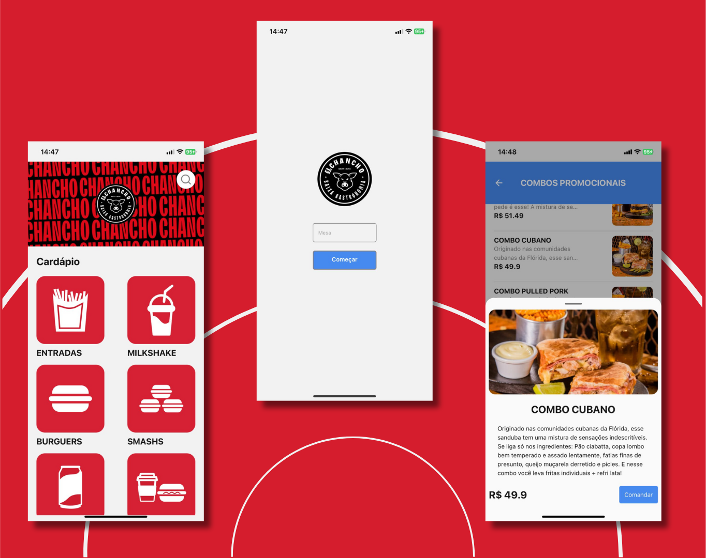

    # El Chancho Menu




> Este projeto fornece um menu digital interativo. Ideal para restaurantes que buscam uma solução moderna e prática. 

### Ajustes e melhorias

O projeto ainda está em desenvolvimento e as próximas atualizações serão voltadas para as seguintes tarefas:

- [x] Implementação do layout básico
- [ ] Integração com API de pedidos
- [ ] Suporte a múltiplos idiomas
- [ ] Otimização para dispositivos móveis
- [ ] Funcionalidade de busca no menu

## 💻 Pré-requisitos

Antes de começar, verifique se você atendeu aos seguintes requisitos:

- Você instalou a versão mais recente do Node.js
- Seu sistema operacional é compatível (Windows, Linux ou macOS)
- Você leu a documentação relacionada ao projeto disponível no repositório

## 🚀 Instalando El Chancho Menu

Para instalar o El Chancho Menu, siga estas etapas:

Linux e macOS:

```
git clone https://github.com/nicoryy/el_chancho_menu.git
cd el_chancho_menu
npm install
```

Windows:

```
git clone https://github.com/nicoryy/el_chancho_menu.git
cd el_chancho_menu
npm install
```

## ☕ Usando El Chancho Menu

Para usar El Chancho Menu, siga estas etapas:

```
npm start
```

Acesse o aplicativo no seu navegador através de `http://localhost:3000`.

## 📫 Contribuindo para El Chancho Menu

Para contribuir com El Chancho Menu, siga estas etapas:

1. Bifurque este repositório.
2. Crie um branch: `git checkout -b <nome_branch>`.
3. Faça suas alterações e confirme-as: `git commit -m '<mensagem_commit>'`
4. Envie para o branch original: `git push origin <nome_branch>`
5. Crie a solicitação de pull.

Como alternativa, consulte a documentação do GitHub em [como criar uma solicitação pull](https://help.github.com/en/github/collaborating-with-issues-and-pull-requests/creating-a-pull-request).